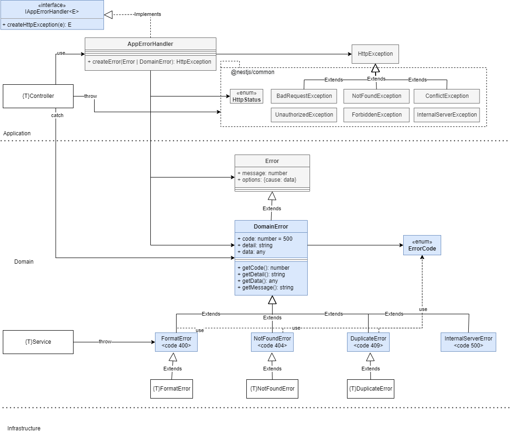

## Description

Implementation of hexa3 architecture (hex - adapter port) using Typescript, [Nest](https://github.com/nestjs/nest) and mongo.

## Global Architecture Draft

Main concepts for this architecture Hexa Three Levels are around codebase scalability using Arquitectura hexagonal and DDD. The goal is to provide a clean architecture while flexible for implementing and growing functionalities into the codebase.


## Hexagonal three levels

The hexagonal architecture is based on three principles and techniques:

- Explicitly separate User-Side (app), Business Logic (domain), and Server-Side (infra).
- Dependencies are going from User-Side and Server-Side to the Business Logic (domain).
- We isolate the boundaries by using Ports (interfaces) and Adapters (implementations).


## Folder structure for three levels

```bash
.
└── src
    ├── app # Layer that exposes application to external world and users, and configure and launch the application module(s)
    │     ├── middleware # called before the route handler or controllers
    │     ├── filter
    │     ├── guard # Authorizator that determine whether a given request will be handled by the route handler or not
    │     ├── dto # Data Transfer Objects 
    │     └── controller # API Controllers responsible for handling incoming requests and returning responses to the client (routing)
    ├── domain # Layer for the domain to Business Logic
    │     ├── incoming # input-port, services interfaces 
    │     ├── service # Layer that composes application use cases 
    │     ├── model # Business domain classes and everything that composes domain model (Entities and Value Objects)
    │     └── outgoing # output-port to infrastructure interfaces
    │
    └── infra # Layer for communication with what is external of application and infrastructure
        ├── database # output-port to infrastructure interfaces
        │     ├── repository # implementation of repository pattern
        │     └── schema # Model schema for database
        └── etc 
```
## Hexa-three-levels, proposal implementation diagram


In this diagram, the light blue elements are the ones that this library contains, the others are the ones that can be created for particular implementations. Generic types are used where T indicates the name of the type of the entity to implement.


## Errors Management Strategy

The error management strategy used is to have the individual services in the domain throw a new subclass of DomainError(), and have the controller catch them and then, via an error handler or an interceptor, throw the appropriate type of HttpException (BadRequestException, ForbiddenException, etc. ). Having Http related stuff in domain layer (services) just seems wrong. For this reason, the domain layer does not handle http exceptions and will only attach an error code included in Domain Error to help the app layer determine which http exception corresponds.



The app layer (controllers, middleware, etc.) will throw exceptions in the response with the following JSON format:
```bash
{
    "statusCode": 400,
    "timestamp": "2022-11-03T20:38:09.613Z",
    "path": "/api/webshop/v1/profiles/all",
    "payload": {
        "code": 400,
        "detail": "Not authorized by the Auth Guard Middleware because no authorization data in Header.",
        "data": {
            "method": "GET",
            "url": "/api/webshop/v1/profiles/all"
        },
        "name": "HeadersAuthorizationError"
    },
    "message": "The headers Authorization in HTTP Request has a format error."
}
```

## Installation

```bash
$ npm install
```

## Test

```bash
# unit tests
$ npm run test

# e2e tests
$ npm run test:e2e

# test coverage
$ npm run test:cov
```

## Build the lib

```bash
# build
$ npm run build

# create pack hexa-three-levels-X.Y.Z.tgz
$ npm pack   

```


## Lib manual and local installation

The project where you want to import the library:

```bash
$ npm install hexa-three-levels-X.Y.Z.tgz
```

The library is installed in:

```bash
.
└── node_modules
    ├── hexa-three-levels # lib
```

And use:
```bash
import { IRepository } from "hexa-three-levels";
```

## References

- https://blog.octo.com/hexagonal-architecture-three-principles-and-an-implementation-example/#:~:text=The%20hexagonal%20architecture%20is%20based,by%20using%20Ports%20and%20Adapters
- https://www.tsmean.com/articles/how-to-write-a-typescript-library/

## Stay in touch

- Author - [Dario Palminio](linkedin.com/in/palminio)

